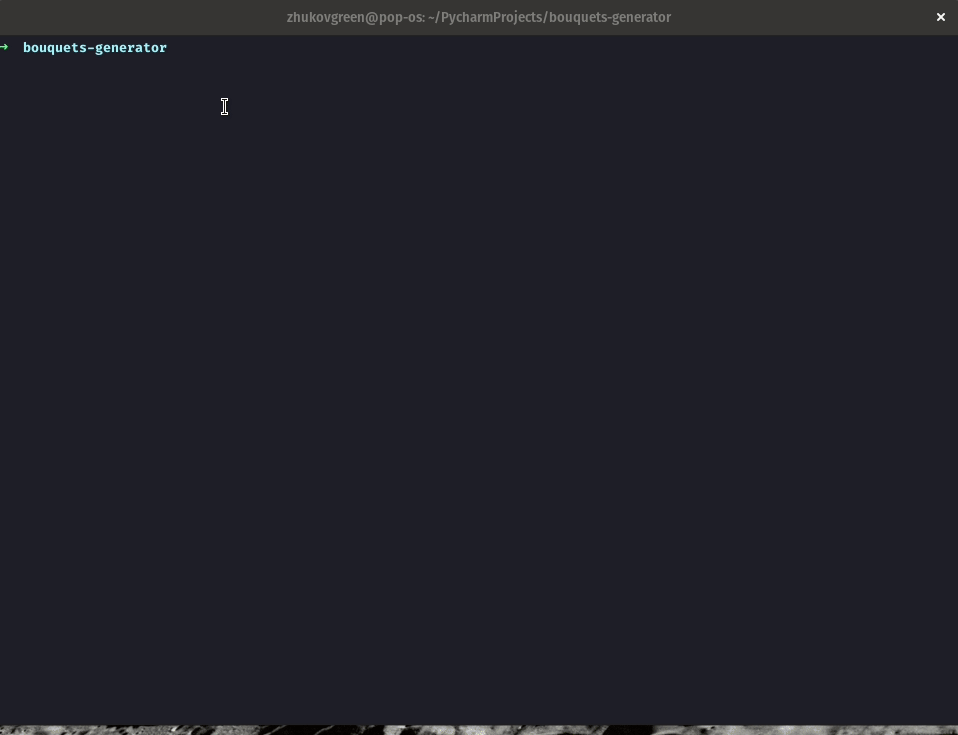

# Bouquets generator

This is a Cli tool

```
Usage: bouquets [OPTIONS] SRC TARGET
  Bouquets design stream as input -> boquets as output.
  This tool takes file as two input stream - bouquet designs stream -  flowers stream
  Based on these two streams the utility generates a stream: - bouquet
  stream
Options:  -v, --verbose  Verbosity of the tool
  --help         Show this message and exit.
```

# Demo


# Dockerfile

Run tests:

- docker-compose run tests

Play with the cli

[in docker]
- docker-compose run cli
- poetry run bouquets --help

[in local]
- poetry install
- poetry shell
- bouquets --help